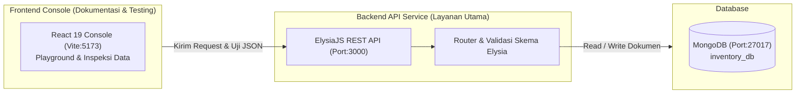
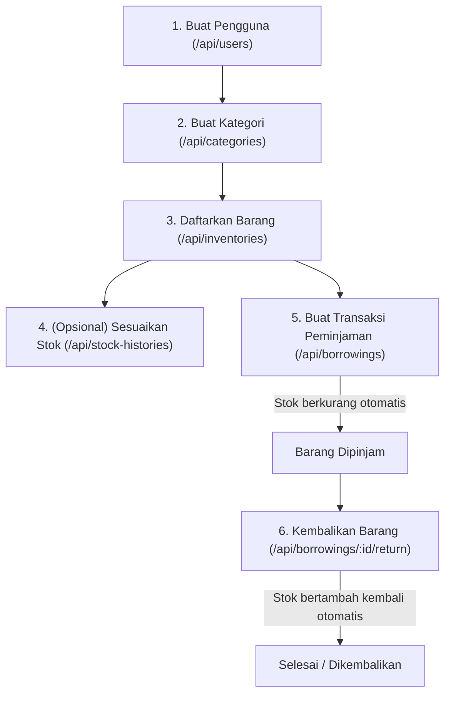

# 📦 Cold Driver - REST API Inventaris & Peminjaman Barang

[](https://elysiajs.com)
[](https://bun.sh)
[](https://react.dev)
[](https://www.typescriptlang.org)
[](https://vitejs.dev)
[](https://www.mongodb.com)

**Cold Driver** adalah backend REST API berkinerja tinggi untuk sistem manajemen inventaris aset, pencatatan mutasi stok, serta siklus peminjaman dan pengembalian barang (*multi-item*) yang dibangun dengan **Bun**, **ElysiaJS**, dan **MongoDB**.

> 💡 **Informasi Frontend**: Proyek ini dilengkapi dengan modul **Frontend Console (Interactive Documentation & Playground)** berbasis React 19. Modul frontend ini berfungsi khusus sebagai **antarmuka dokumentasi dan testing API** agar pengembang dapat menginspeksi isi koleksi database dan menguji request JSON secara interaktif tanpa harus bergantung pada tools eksternal seperti Postman/cURL.

---

## 📑 Daftar Isi

- [Fitur Utama Backend](#-fitur-utama-backend)
- [Arsitektur & Teknologi](#-arsitektur--teknologi)
- [Struktur Direktori](#-struktur-direktori)
- [Prasyarat Sistem](#-prasyarat-sistem)
- [Panduan Instalasi & Menjalankan (Step-by-Step)](#-panduan-instalasi--menjalankan-step-by-step)
  - [Langkah 1: Clone Repository](#langkah-1-clone-repository)
  - [Langkah 2: Menyiapkan Database MongoDB](#langkah-2-menyiapkan-database-mongodb)
  - [Langkah 3: Konfigurasi & Menjalankan Backend API (Layanan Utama)](#langkah-3-konfigurasi--menjalankan-backend-api-layanan-utama)
  - [Langkah 4: Menjalankan Frontend Console (Playground Dokumentasi)](#langkah-4-menjalankan-frontend-console-playground-dokumentasi)
  - [Langkah 5: Akses Konsol Dokumentasi di Browser](#langkah-5-akses-konsol-dokumentasi-di-browser)
- [Alur Kerja Penggunaan (Workflow Demo)](#-alur-kerja-penggunaan-workflow-demo)
- [Dokumentasi API Endpoints](#-dokumentasi-api-endpoints)
  - [Overview Endpoints](#overview-endpoints)
  - [1. Pengguna (Users)](#1-pengguna-users)
  - [2. Kategori (Categories)](#2-kategori-categories)
  - [3. Inventaris (Inventories)](#3-inventaris-inventories)
  - [4. Mutasi Stok (Stock Histories)](#4-mutasi-stok-stock-histories)
  - [5. Peminjaman & Pengembalian (Borrowings)](#5-peminjaman--pengembalian-borrowings)
  - [6. Pengumuman & Dokumentasi (Content)](#6-pengumuman--dokumentasi-content)
- [Skrip Bantuan & Maintenance](#-skrip-bantuan--maintenance)
- [Troubleshooting & FAQ](#-troubleshooting--faq)

---

## ✨ Fitur Utama Backend

- 👥 **Manajemen Pengguna & Peran**: Pengelolaan akun pengguna dengan klasifikasi peran (*role*): `admin`, `petugas`, dan `peminjam`.
- 🏷️ **Katalog Kategori & Barang Inventaris**: Pencatatan spesifikasi barang, kode unik, kondisi, lokasi penyimpanan, dan pencarian cepat (*search* berdasarkan nama atau kode barang).
- 📈 **Mutasi Stok Otomatis**: Pencatatan riwayat stok masuk (*in*) dan keluar (*out*) yang secara otomatis memutakhirkan jumlah stok barang secara presisi dengan validasi ketersediaan.
- 🔄 **Siklus Peminjaman & Pengembalian Lengkap**:
  - Peminjaman mendukung banyak barang sekaligus (*multi-item*) dalam satu transaksi.
  - Kode unik peminjaman dibuat otomatis (`PJ-0001`, `PJ-0002`, dst.).
  - Otomatis mengurangi kuota stok inventaris saat peminjaman dibuat.
  - Validasi ketersediaan stok sebelum peminjaman disetujui.
  - Pengembalian barang otomatis memulihkan jumlah stok ke gudang dan mencatat kondisi akhir barang saat kembali.
- 📢 **Pusat Informasi & Dokumentasi**: Modul pengumuman internal serta dokumentasi foto dan catatan kegiatan.
- 🧪 **Interactive Documentation Console (Frontend)**: Konsol antarmuka visual untuk mengeksplorasi koleksi database, memformat data JSON secara rapi, dan menguji pengiriman data ke REST API secara live.

---

## 🏗️ Arsitektur & Teknologi

### Stack Teknologi

| Komponen | Teknologi | Keterangan |
| :--- | :--- | :--- |
| **Backend Runtime** | [Bun](https://bun.sh/) (v1.0+) | JavaScript/TypeScript runtime berperforma sangat tinggi |
| **Web Framework** | [ElysiaJS](https://elysiajs.com/) (v1.4+) | Framework web modern berkinerja tinggi berbasis Bun |
| **Database** | [MongoDB](https://www.mongodb.com/) (v6.0+) | Database NoSQL dokumen dengan driver resmi MongoDB Node.js v6 |
| **Dokumentasi UI** | [React](https://react.dev/) (v19) + [Vite](https://vitejs.dev/) | Konsol playground interaktif untuk inspeksi data & testing API |
| **Bahasa Pemrograman** | [TypeScript](https://www.typescriptlang.org/) (v5+) | Static typing menyeluruh di seluruh codebase |
| **Code Quality** | [Oxlint](https://oxc.rs/) | Linter TypeScript/JavaScript super cepat |

### Alur Sistem



---

## 📁 Struktur Direktori

```text
cold-driver/
├── backend/                  # Layanan Utama: Backend REST API (Bun + Elysia + MongoDB)
│   ├── .env.example          # Contoh template environment variables
│   ├── index.ts              # Entry point server backend (port listener)
│   ├── package.json          # Dependensi & script backend
│   ├── tsconfig.json         # Konfigurasi TypeScript backend
│   └── src/
│       ├── app.ts            # Registrasi routing, CORS, dan middleware Elysia
│       ├── db.ts             # Koneksi MongoDB client & helper sequence ID
│       ├── types.ts          # Definisi interface TypeScript model data
│       └── routes/           # Handler REST API modular
│           ├── borrowings.ts # Endpoint peminjaman & pengembalian
│           ├── catalog.ts    # Endpoint kategori, inventaris & mutasi stok
│           ├── content.ts    # Endpoint pengumuman & dokumentasi
│           └── users.ts      # Endpoint manajemen pengguna
│
├── frontend/                 # Modul Tambahan: Konsol Dokumentasi & Playground API (React + Vite)
│   ├── index.html            # File HTML root Vite
│   ├── package.json          # Dependensi & script frontend playground
│   ├── vite.config.ts        # Konfigurasi bundler Vite
│   └── src/
│       ├── main.tsx          # Bootstrapping React DOM
│       ├── App.tsx           # Konsol workspace dokumentasi & form pengujian JSON
│       ├── App.css           # Desain konsol modern
│       └── index.css         # Reset styling
│
├── .gitignore                # Berkas yang diabaikan oleh Git
└── README.md                 # Dokumentasi utama proyek
```

---

## ⚙️ Prasyarat Sistem

Sebelum menjalankan backend dan konsol dokumentasi, pastikan perangkat Anda telah terpasang:

1. **[Bun](https://bun.sh/)** (Versi 1.0.0 atau lebih baru)
   - Cek instalasi: `bun --version`
   - Windows (PowerShell):
     ```powershell
     powershell -c "irm bun.sh/install.ps1 | iex"
     ```
   - macOS / Linux:
     ```bash
     curl -fsSL https://bun.sh/install | bash
     ```
2. **[MongoDB](https://www.mongodb.com/)** (Versi 6.0 atau lebih baru)
   - Dapat menggunakan **Docker** (paling praktis), **MongoDB Community Server** lokal, atau **MongoDB Atlas**.
3. **[Git](https://git-scm.com/)**
   - Untuk menduplikasi repository.

---

## 🚀 Panduan Instalasi & Menjalankan (Step-by-Step)

Ikuti langkah-langkah di bawah ini secara berurutan untuk menjalankan backend API dan konsol dokumentasinya:

### Langkah 1: Clone Repository

Buka terminal atau PowerShell, lalu clone repositori ke komputer Anda:

```bash
git clone https://github.com/Dacuvis/cold-driver.git
cd cold-driver
```

---

### Langkah 2: Menyiapkan Database MongoDB

Pastikan instance MongoDB sedang aktif pada port default `27017`. Anda dapat memilih salah satu opsi berikut:

#### Opsi A: Menggunakan Docker (Direkomendasikan & Paling Praktis)
Jika Anda memiliki Docker Desktop:
```bash
docker run -d --name mongo-inventory -p 27017:27017 mongo:6
```

#### Opsi B: Menggunakan Service Lokal Komputer
- **Windows**: Pastikan service `MongoDB` aktif melalui aplikasi *Services* atau jalankan perintah:
  ```powershell
  net start MongoDB
  ```
- **macOS (Homebrew)**:
  ```bash
  brew services start mongodb-community
  ```
- **Linux (systemd)**:
  ```bash
  sudo systemctl start mongod
  ```

---

### Langkah 3: Konfigurasi & Menjalankan Backend API (Layanan Utama)

1. Masuk ke direktori `backend`:
   ```bash
   cd backend
   ```

2. Buat file konfigurasi `.env` dari template yang telah disediakan:
   - Di Windows (PowerShell / CMD):
     ```powershell
     copy .env.example .env
     ```
   - Di macOS / Linux:
     ```bash
     cp .env.example .env
     ```

3. Periksa isi file `.env` (nilai default sudah siap digunakan untuk MongoDB lokal):
   ```env
   PORT=3000
   MONGODB_URI=mongodb://127.0.0.1:27017
   MONGODB_DB=inventory_db
   ```

4. Install seluruh dependensi backend:
   ```bash
   bun install
   ```

5. Jalankan server backend:
   ```bash
   bun run index.ts
   ```
   > 💡 **Tips Mode Watch**: Gunakan `bun run --watch index.ts` agar server otomatis restart jika Anda mengubah kode backend.

6. **Verifikasi Backend**:
   Jika berhasil, terminal akan menampilkan output:
   ```text
   Inventory API running at http://localhost:3000
   ```
   Anda dapat memverifikasi kesehatan server melalui peramban atau cURL:
   ```bash
   curl http://localhost:3000/health
   ```
   *Respons:*
   ```json
   { "status": "ok", "timestamp": "2026-09-10T18:30:00.000Z" }
   ```

---

### Langkah 4: Menjalankan Frontend Console (Playground Dokumentasi)

> ℹ️ **Catatan**: Modul frontend ini disediakan sebagai alat bantu visual (GUI) untuk mempermudah Anda membaca isi database dan menguji pengiriman data ke endpoint backend.

1. Buka **jendela terminal baru** (biarkan terminal backend tetap berjalan) dan masuk ke direktori `frontend`:
   ```bash
   cd frontend
   ```

2. Install dependensi frontend:
   ```bash
   bun install
   ```

3. Jalankan development server konsol dokumentasi:
   ```bash
   bun dev
   ```

4. Terminal akan menampilkan tautan server Vite lokal, biasanya:
   ```text
     VITE v8.2.2  ready in 250 ms

     ➜  Local:   http://localhost:5173/
     ➜  Network: use --host to expose
   ```

---

### Langkah 5: Akses Konsol Dokumentasi di Browser

Buka peramban (browser) Anda dan kunjungi:
👉 **`http://localhost:5173`**

Pada konsol ini Anda dapat:
- Memilih koleksi database di bilah kiri (`users`, `categories`, `inventories`, `stock-histories`, dll.).
- Mengklik tombol **"Refresh data"** untuk membaca data dari backend API (`http://localhost:3000/api/{resource}`).
- Memasukkan atau mengubah dokumen JSON di panel kanan lalu menekan tombol **"Simpan ke database"** untuk menguji request POST langsung.

---

## 🔄 Alur Kerja Penggunaan (Workflow Demo)

Karena beberapa koleksi memiliki keterkaitan ID relasional (*reference keys*), ikuti urutan alur berikut saat menguji pengisian data melalui konsol dokumentasi atau cURL/Postman:



### 1. Buat Pengguna Pertama
Pilih menu **users** pada konsol dokumentasi atau kirim request:
- **POST** `/api/users`
```json
{
  "nama": "Ahmad Petugas",
  "username": "ahmad",
  "password": "password123",
  "role": "petugas",
  "kelas": "Staf Lab"
}
```
*Sistem akan menghasilkan data user dengan `id: 1`.*

### 2. Buat Kategori Barang
Pilih menu **categories**:
- **POST** `/api/categories`
```json
{
  "namaKategori": "Elektronik & Multimedia",
  "deskripsi": "Peralatan audio, visual, dan komputer"
}
```
*Sistem akan menghasilkan kategori dengan `id: 1`.*

### 3. Daftarkan Barang Inventaris
Pilih menu **inventories**:
- **POST** `/api/inventories`
```json
{
  "categoryId": 1,
  "kodeBarang": "LAP-001",
  "namaBarang": "Laptop Dell Latitude",
  "stok": 10,
  "kondisi": "Sangat Baik",
  "lokasi": "Lemari Lab 2",
  "deskripsi": "Core i5, 16GB RAM, SSD 512GB"
}
```
*Sistem akan menghasilkan barang dengan `id: 1`.*

### 4. Transaksi Peminjaman Barang
Kirim request ke endpoint borrowings:
- **POST** `/api/borrowings`
```json
{
  "userId": 1,
  "namaPeminjam": "Budi Santoso",
  "kelas": "XII RPL 1",
  "tujuan": "Ujian Kompetensi Kejuruan",
  "tanggalPinjam": "2026-09-10",
  "parafGuru": "Pak Joko",
  "items": [
    {
      "inventoryId": 1,
      "jumlah": 2,
      "kondisiPinjam": "Baik"
    }
  ]
}
```
> ⚡ **Efek Otomatis**: Stok barang `LAP-001` akan otomatis berkurang dari **10** menjadi **8**. Transaksi mendapat kode peminjaman `PJ-0001` dengan status `"dipinjam"`.

### 5. Pengembalian Peminjaman
Kirim request pengembalian dengan menyertakan ID transaksi peminjaman:
- **POST** `/api/borrowings/1/return`
```json
{
  "tanggalKembali": "2026-09-12",
  "items": [
    {
      "itemId": 1,
      "kondisiKembali": "Baik, lengkap dengan charger"
    }
  ]
}
```
> ⚡ **Efek Otomatis**: Status peminjaman berubah menjadi `"dikembalikan"`, dan stok barang `LAP-001` otomatis bertambah kembali sebanyak 2 unit (menjadi **10**).

---

## 📖 Dokumentasi API Endpoints

Base URL API: `http://localhost:3000`  
Prefix Resource: `/api`

### Overview Endpoints

| Metode | Path | Deskripsi |
| :--- | :--- | :--- |
| `GET` | `/` | Informasi nama dan versi API |
| `GET` | `/health` | Pemeriksaan status kesehatan layanan (*health check*) |
| `GET` | `/api` | Ringkasan daftar resource yang tersedia |
| `GET`, `POST` | `/api/users` | Ambil semua user / buat user baru |
| `GET`, `POST` | `/api/categories` | Ambil semua kategori / buat kategori baru |
| `GET`, `POST` | `/api/inventories` | Ambil barang (dukung `?search=`) / daftarkan barang |
| `GET`, `POST` | `/api/stock-histories` | Ambil riwayat mutasi stok / catat mutasi stok |
| `GET`, `POST` | `/api/borrowings` | Ambil daftar peminjaman / buat peminjaman baru |
| `POST` | `/api/borrowings/:id/return` | Proses pengembalian barang pinjaman |
| `GET`, `POST` | `/api/announcements` | Ambil pengumuman / buat pengumuman baru |
| `GET`, `POST` | `/api/documentations` | Ambil dokumentasi kegiatan / buat dokumentasi |

---

### 1. Pengguna (Users)

#### `GET /api/users`
Mengambil seluruh daftar pengguna. Password disembunyikan secara otomatis demi keamanan.

#### `POST /api/users`
Menambahkan pengguna baru ke sistem.
```json
// Body Request
{
  "nama": "Siti Nurhaliza",
  "username": "siti",
  "password": "passwordAman123", // Min. 6 karakter
  "role": "peminjam",             // "admin" | "petugas" | "peminjam"
  "kelas": "XI TKJ 2"             // Opsional
}
```

---

### 2. Kategori (Categories)

#### `GET /api/categories`
Mengambil semua kategori barang inventaris.

#### `POST /api/categories`
Membuat kategori barang baru.
```json
// Body Request
{
  "namaKategori": "Jaringan & Telekomunikasi",
  "deskripsi": "Kabel, router, switch, crimping tools" // Opsional
}
```

---

### 3. Inventaris (Inventories)

#### `GET /api/inventories`
Mendapatkan semua barang inventaris.  
Mendukung parameter query `search` untuk memfilter berdasarkan nama barang atau kode barang (*case-insensitive*):
```http
GET /api/inventories?search=kabel
```

#### `POST /api/inventories`
Mendaftarkan barang baru ke database (membutuhkan `categoryId` yang sudah terdaftar).
```json
// Body Request
{
  "categoryId": 1,
  "kodeBarang": "NET-002",
  "namaBarang": "Crimping Tool RJ45",
  "stok": 15,
  "kondisi": "Baik",
  "lokasi": "Rak Alat 3",
  "deskripsi": "Tang crimping multi-konektor" // Opsional
}
```

---

### 4. Mutasi Stok (Stock Histories)

#### `GET /api/stock-histories`
Mengambil seluruh riwayat perubahan stok yang diurutkan dari yang paling baru.

#### `POST /api/stock-histories`
Menambahkan catatan perubahan stok secara manual (masuk atau keluar). Stok barang terkait akan otomatis disesuaikan.
```json
// Body Request
{
  "inventoryId": 1,
  "userId": 1,
  "jenis": "masuk", // "masuk" (stok +) atau "keluar" (stok -)
  "jumlah": 5,
  "keterangan": "Pengadaan APBN 2026" // Opsional
}
```

---

### 5. Peminjaman & Pengembalian (Borrowings)

#### `GET /api/borrowings`
Mengambil seluruh data peminjaman beserta detail barang yang dipinjam (`items`).

#### `POST /api/borrowings`
Mengajukan transaksi peminjaman barang. Kuota stok akan otomatis dipotong dan divalidasi.
```json
// Body Request
{
  "userId": 1,
  "namaPeminjam": "Rudi Pratama",
  "kelas": "XII RPL 2",
  "tujuan": "Praktikum Jaringan",
  "tanggalPinjam": "2026-09-10",
  "parafGuru": "Ibu Ratna", // Opsional
  "items": [
    {
      "inventoryId": 1,
      "jumlah": 1,
      "kondisiPinjam": "Normal & Bersih"
    }
  ]
}
```

#### `POST /api/borrowings/:id/return`
Memproses pengembalian peminjaman barang. Stok barang yang dipinjam akan otomatis dikembalikan ke inventaris.
```json
// Body Request
{
  "tanggalKembali": "2026-09-11",
  "items": [
    {
      "itemId": 1,
      "kondisiKembali": "Baik tanpa cacat"
    }
  ]
}
```

---

### 6. Pengumuman & Dokumentasi (Content)

#### `POST /api/announcements`
```json
// Body Request
{
  "judul": "Jadwal Inventarisasi Tahunan",
  "isi": "Seluruh peminjaman wajib dikembalikan sebelum tanggal 20 bulan ini.",
  "thumbnail": "https://example.com/banner.jpg", // Opsional
  "createdBy": 1
}
```

#### `POST /api/documentations`
```json
// Body Request
{
  "judul": "Pemeriksaan Aset Laboratorium Komputer",
  "kategori": "Maintenance",
  "deskripsi": "Pengecekan kondisi fisik seluruh PC & Proyektor", // Opsional
  "foto": "https://example.com/foto.jpg",                         // Opsional
  "tanggal": "2026-09-08",
  "createdBy": 1
}
```

---

## 🛠️ Skrip Bantuan & Maintenance

### Backend (Layanan Utama)
Jalankan di direktori `backend/`:
```bash
# Jalankan server API
bun run index.ts

# Jalankan server dengan live reload (watch mode)
bun run --watch index.ts

# Typecheck kode TypeScript backend
bunx tsc --noEmit
```

### Frontend Console (Playground Dokumentasi)
Jalankan di direktori `frontend/`:
```bash
# Jalankan development server konsol
bun dev

# Linting kode dengan Oxlint
bun run lint

# Build production konsol
bun run build

# Preview hasil build production lokal
bun run preview
```

---

## ❓ Troubleshooting & FAQ

### 1. Error: `ECONNREFUSED 127.0.0.1:27017` / MongoDB Connection Failed
- **Penyebab**: Service database MongoDB belum berjalan.
- **Solusi**:
  - Jika memakai Docker: Jalankan `docker start mongo-inventory` atau `docker run -d --name mongo-inventory -p 27017:27017 mongo:6`.
  - Jika memakai instalasi lokal Windows: Buka PowerShell sebagai Administrator dan ketik `net start MongoDB`.

### 2. Konsol Frontend menampilkan pesan `"Backend belum berjalan di http://localhost:3000"`
- **Penyebab**: Server backend belum dijalankan atau port 3000 tidak merespons.
- **Solusi**: Pastikan Anda telah menjalankan `bun run index.ts` di folder `backend`, dan endpoint `http://localhost:3000/health` dapat dibuka di browser dengan status `ok`.

### 3. Port 3000 atau 5173 bentrok (*Port already in use*)
- **Backend**: Ubah variabel `PORT=3001` pada file `backend/.env`.
- **Frontend**: Vite akan secara otomatis menawarkan port berikutnya (misalnya `5174`).

### 4. Eksekusi Script Bun Ditolak di Windows PowerShell (`PSSecurityException`)
- **Penyebab**: Kebijakan eksekusi skrip PowerShell belum diizinkan untuk akun pengguna saat ini.
- **Solusi**: Buka PowerShell dan jalankan perintah:
  ```powershell
  Set-ExecutionPolicy RemoteSigned -Scope CurrentUser
  ```

---

## 📄 Lisensi

Proyek ini dirilis untuk keperluan internal dan portofolio.  
Dibangun menggunakan teknologi performa tinggi **Bun, ElysiaJS, dan MongoDB**.